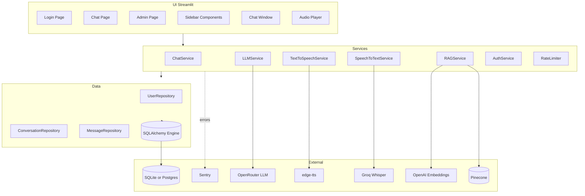
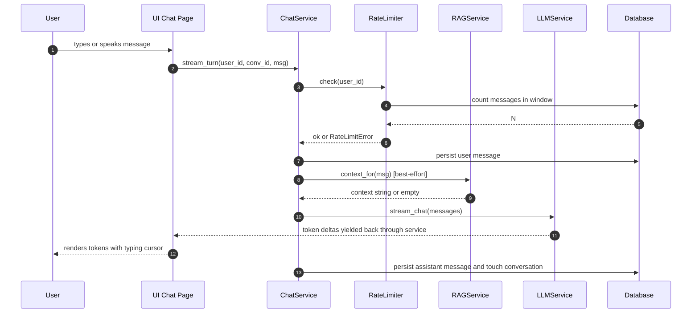
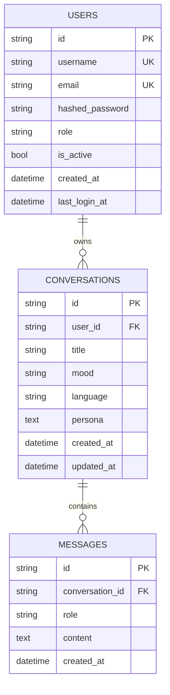

# Architecture

This document explains how Rupa AI is structured, why each piece exists, and
what trade-offs were made.

---

## High-level layers



**Three layers, strict dependency direction**:

- `ui/` -> `services/` -> `db/`
- `ui/` never imports from `db/` directly.
- `services/` never imports from `ui/`.

This makes the services layer testable with no Streamlit context.

---

## Request lifecycle: one chat turn



---

## Data model



- **UUID primary keys** (string-encoded) for portability across SQLite and Postgres.
- **Cascade deletes**: deleting a user removes their conversations and messages.
- **`ON CONFLICT` not used** — duplicates raise `IntegrityError`, translated to `UserAlreadyExistsError`.

---

## Key design decisions

### 1. Stay on Streamlit (no FastAPI yet)

Streamlit gives us single-file deployment to Streamlit Cloud, free hosting,
and simple iteration. Services are plain Python classes with no Streamlit
imports, so a future FastAPI layer is a drop-in addition rather than a
rewrite.

**Trade-off**: Streamlit is opinionated about reruns and state. We accept
that and isolate per-user state in `session_state`, with the durable state
in SQL.

### 2. SQLAlchemy 2.0 with SQLite default

Works out-of-the-box for solo / small-team. Set `DATABASE_URL=postgresql+psycopg2://...`
to switch — no code change. Alembic migrations work for both.

**SQLite specifics**: we enable `WAL` mode and `foreign_keys=ON` on connect.
`check_same_thread=False` is required because Streamlit reruns scripts on
different threads.

### 3. Repository pattern

Each aggregate root has a thin repository:

- `UserRepository`
- `ConversationRepository`
- `MessageRepository`

Services and UI code never write raw SQL. This gives:

- Easy mocking in tests
- A single place to enforce per-user filtering (security)
- A future swap to a different ORM costs only the repos

### 4. Persistent sliding-window rate limiter

`RateLimiter.check()` simply counts user-role messages from this user in
the last N seconds. Stored alongside the data — no Redis, no in-memory
cache to lose on restart.

**When to upgrade**: switch to Redis with a Lua script when traffic exceeds
a few hundred RPS per pod.

### 5. Streaming everywhere

`LLMService.stream_chat()` yields `str` deltas. `ChatService.stream_turn()`
re-yields them after persisting the user message; the UI calls `st.empty()`
+ `placeholder.markdown()` for the typing-cursor effect.

The final assistant message is persisted in the iterator's `finally` block
so partial responses are still recorded if the user navigates away mid-stream.

### 6. Custom exception hierarchy

Every exception derives from `RupaError` and carries a `user_message`
distinct from its `log_message`. UI layers display `user_message`; loggers
record `log_message` + stack trace. This stops sensitive details from
leaking to end users while keeping them debuggable for operators.

### 7. Structured logging with structlog

`json` format in production goes to stdout, gets picked up by your log
aggregator. `console` format in dev is colourised and human-readable.
Application context (`env`, `app`) is auto-injected on every log line.

### 8. RAG with optional fallback

`RAGService` requires `PINECONE_API_KEY`. The chat page catches missing-RAG
configuration gracefully — chat works without it, just without uploaded
knowledge.

The embedding client prefers `OPENAI_API_KEY` (real OpenAI), falling back
to OpenRouter with a warning, because OpenRouter doesn't reliably proxy
embedding endpoints.

### 9. Per-user TTS files

Each TTS output is written to `data/cache/tts_<session>.mp3` (UUID-based),
not a shared `rupa_speech.mp3`. This was a concurrency bug in the original
prototype.

---

## Observability

| Aspect       | Tool             | Where                                        |
| ------------ | ---------------- | -------------------------------------------- |
| Logs         | structlog (JSON) | `app/logging_setup.py`                       |
| Errors       | Sentry           | `app/observability.py` (auto if DSN set)     |
| Metrics      | -                | (out of scope, add OpenTelemetry if needed)  |
| Tracing      | -                | (Sentry traces ready, sample rate via env)   |
| Health check | Streamlit native | `/_stcore/health` used by Docker healthcheck |

---

## Security model

- **Passwords**: bcrypt (cost factor 12) — never stored in plaintext.
- **Sessions**: Streamlit `session_state`. For an HTTPS deploy behind a
  proxy, the `AUTH_COOKIE_KEY` is reserved for future cookie-based session
  signing.
- **Per-user isolation**: every query touching `Conversation` or `Message`
  uses `get_for_user` / `list_for_user`. Cross-user access is impossible
  without admin role.
- **Admin gate**: `AuthService.require_admin()` raises `PermissionDeniedError`
  if the current user isn't admin. Used by the admin page.
- **Secrets**: never editable in the UI in production. Dev mode shows an
  override panel for convenience.
- **CSRF**: enabled via `enableXsrfProtection = true` in
  `.streamlit/config.toml`.
- **Rate limiting**: per-user, persistent. See above.

---

## Testing pyramid

```
                 /\
                /  \       1 integration test
               /----\      (full chat flow, all externals mocked)
              /      \
             /  unit  \    50+ unit tests
            /----------\   (services, repos, auth, exceptions, utils)
```

Run with:

```bash
pytest -v
```

CI runs the same suite on Python 3.10, 3.11, and 3.12.

---

## What's out of scope (for now)

- Multi-tenancy beyond per-user filtering (no organisations / workspaces)
- Billing / Stripe
- Async background workers (Celery / RQ)
- True WebSocket streaming (Streamlit's model is enough)
- Mobile app
- LLM fine-tuning
