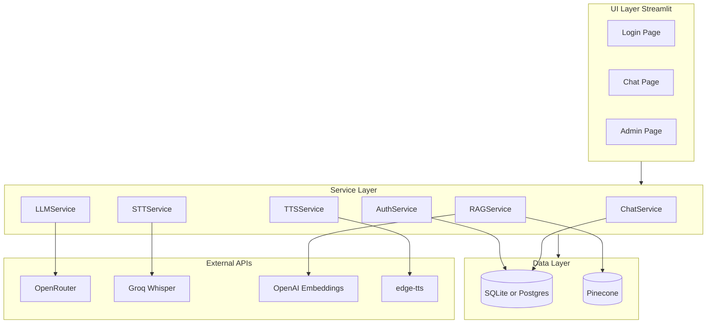

# Rupa AI

> A production-grade bilingual (Bangla & English) conversational AI assistant
> with persistent memory, RAG-backed knowledge, voice I/O, and small-team
> multi-user support.

[](https://github.com/sabyasacheedas/rupa-ai/actions/workflows/ci.yml)
[](https://www.python.org/)
[](LICENSE)
[](https://github.com/astral-sh/ruff)
[](https://streamlit.io/)

---

## Highlights

- **Bilingual conversation** in Bangla and English with language-aware prompting and voice.
- **Persona-driven** chat with per-conversation system prompts and mood (Happy / Sad) styling.
- **Persistent memory** — every conversation is stored per user in SQLite or Postgres.
- **RAG** — upload PDFs / DOCX files; Rupa embeds and retrieves them from Pinecone.
- **Voice I/O** — Whisper Large v3 (Groq) for input, edge-tts for natural Bangla / English output.
- **Streaming responses** with token-by-token rendering.
- **Authentication & RBAC** — login, register, admin console, per-user data isolation.
- **Rate-limited and observable** — structured logging, optional Sentry, persistent sliding-window limits.
- **Production-ready** — Docker image, Alembic migrations, GitHub Actions CI, 60%+ test coverage.

---

## Quick start

### Local (with pip)

```bash
git clone https://github.com/sabyasacheedas/rupa-ai.git
cd rupa-ai

python -m venv .venv
.venv\Scripts\activate          # Windows
# source .venv/bin/activate     # macOS / Linux

pip install -e ".[dev]"

cp .env.example .env             # fill in API keys

streamlit run app/main.py
```

Open <http://localhost:8501> and log in with the bootstrap admin credentials
from your `.env` (default `admin` / `ChangeMe123!`). Change them immediately.

### Local (with Docker)

```bash
cp .env.example .env             # fill in API keys
docker compose up --build
```

App is at <http://localhost:8501>; data persists in the `rupa_data` volume.

### CLI

```bash
rupa version
rupa init-db
rupa create-admin alice alice@example.com --password "SuperSecret!23"
```

---

## Architecture



See [`ARCHITECTURE.md`](ARCHITECTURE.md) for a deeper dive.

---

## Required API keys

| Provider     | Used for                            | Get one at                                       |
| ------------ | ----------------------------------- | ------------------------------------------------ |
| OpenRouter   | LLM chat (Qwen 2.5 72B by default)  | <https://openrouter.ai/keys>                     |
| Groq         | Speech-to-text (Whisper Large v3)   | <https://console.groq.com/keys>                  |
| OpenAI       | Embeddings (text-embedding-3-small) | <https://platform.openai.com/api-keys>           |
| Pinecone     | Vector DB for RAG                   | <https://app.pinecone.io>                        |
| Sentry (opt) | Error tracking                      | <https://sentry.io>                              |

> **Note**: an OpenAI key is recommended for embeddings; OpenRouter cannot
> reliably proxy embedding endpoints. RAG is gracefully disabled if no
> Pinecone key is provided.

---

## Deployment

### Streamlit Cloud

1. Push your fork to GitHub.
2. Create a new app from <https://share.streamlit.io> with:
   - Main file path: `app/main.py`
   - Branch: `main`
3. In **Manage app -> Settings -> Secrets**, paste the contents of
   [`.streamlit/secrets.toml.example`](.streamlit/secrets.toml.example) with
   your real values.
4. **Important**: Streamlit Cloud has ephemeral storage. For persistent
   conversations across restarts, set `DATABASE_URL` to a managed Postgres
   (Neon / Supabase / Railway).

### Docker / Kubernetes

The provided multi-stage [`Dockerfile`](Dockerfile) builds a non-root,
healthchecked image. Bind a volume on `/app/data` for SQLite persistence,
or point `DATABASE_URL` at a managed Postgres.

```bash
docker build -t rupa-ai:1.0.0 .
docker run -p 8501:8501 --env-file .env -v rupa_data:/app/data rupa-ai:1.0.0
```

---

## Development

```bash
pip install -e ".[dev]"
pre-commit install

# Run quality gates locally
ruff check app tests
ruff format --check app tests
mypy app
pytest -v
```

See [`CONTRIBUTING.md`](CONTRIBUTING.md) for the full contributor workflow.

---

## Project structure

```
app/
├── main.py             Streamlit entry, routing
├── bootstrap.py        Idempotent startup (DB, logging, Sentry, admin)
├── config.py           Pydantic Settings
├── exceptions.py       RupaError hierarchy
├── logging_setup.py    structlog configuration
├── observability.py    Sentry initialisation
├── cli.py              `rupa` admin CLI
├── auth/               Authentication & RBAC
├── db/                 SQLAlchemy models, sessions, repositories
├── services/           Business logic (LLM, RAG, TTS, STT, Chat)
├── ui/                 Streamlit pages and components
└── utils/              Shared helpers (rate limiting, text)

tests/                  pytest unit + integration
alembic/                Database migrations
.github/workflows/      CI pipeline
```

---

## License

[MIT](LICENSE) © Sabyasachee Das

Built with love for the Bangla-speaking developer community.
